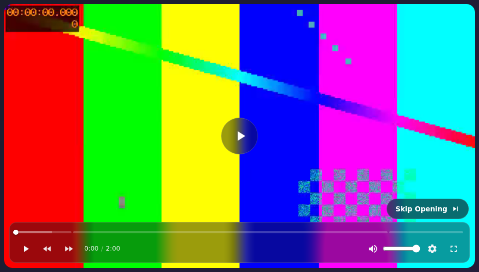
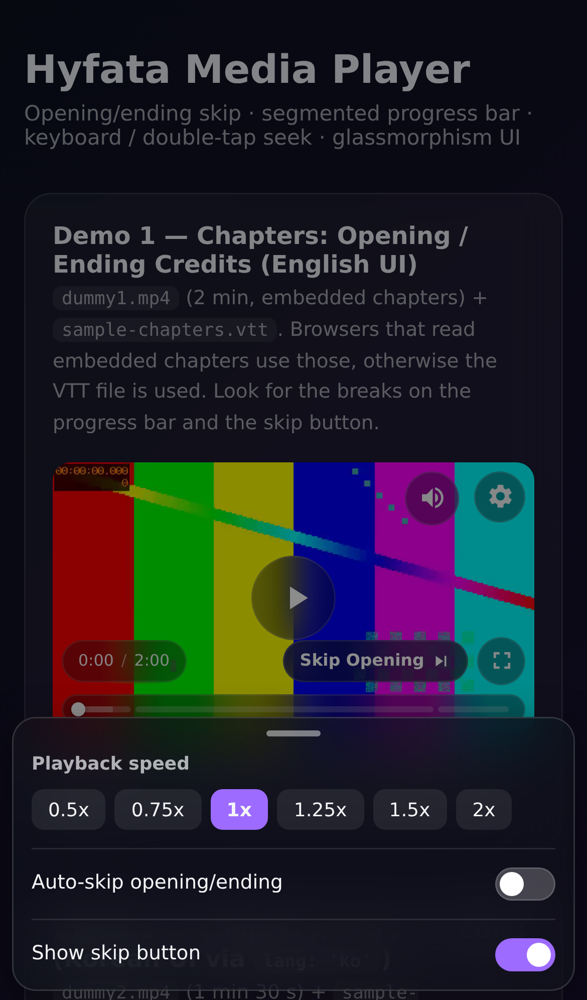

# Hyfata Media Player

**[English version](README.md)**

애니/영화 감상용, 의존성 없는 HTML5 비디오 플레이어. 오프닝/엔딩 스킵,
구간별 재생바, 데스크톱/모바일 각각 최적화된 글래스모피즘 UI를 제공합니다.





## 기능

- **오프닝/엔딩 스킵** — 내장 챕터(지원 브라우저) 또는 WebVTT 챕터 파일로 구간 인식,
  플로팅 스킵 버튼 + 자동 스킵 옵션
- **구간별 재생바** — 오프닝/엔딩 경계에 실제 끊김 표시, 시간+구간명 툴팁
- **글래스모피즘 UI** — 데스크톱 컨트롤 패널, 모바일 플로팅 글래스 박스,
  작은 플레이어용 compact 모드
- **모바일 바텀시트 설정** — 재생 속도, 자동 스킵, 스킵 버튼 표시 여부,
  아래로 드래그해서 닫기 + 배경 딤
- **터치 제스처** — 좌/우 더블탭 ±10초 탐색, 한 번 탭으로 컨트롤 표시/숨김
- **키보드 단축키** — 재생/일시정지, 탐색, 볼륨, 음소거, 전체화면, 0–90% 점프
- **다국어(i18n)** — 영어/한국어 내장, 플레이어별 전환 및 확장 가능
  (`VideoPlayer.addLang`)
- **무의존성** — JS + CSS 각 1개 파일, 번들러 없이 `<script>` 태그로도 동작

## 빠른 시작

```html
<link rel="stylesheet" href="video-player.css" />
<div id="player"></div>
<script src="video-player.js"></script>
<script>
  new VideoPlayer('#player', {
    src: 'video.mp4',
    chaptersUrl: 'chapters.vtt'
  });
</script>
```

`index.html`에서 라이브 데모 확인 가능 (영어 UI / 한국어 UI / 챕터 없음 케이스).

## 옵션

| 옵션                 | 타입     | 기본값       | 설명                                              |
| -------------------- | -------- | ------------ | ------------------------------------------------- |
| `src`                | string   | `null`       | 영상 URL                                          |
| `poster`             | string   | `null`       | 포스터 이미지 URL                                 |
| `chaptersUrl`        | string   | `null`       | WebVTT 챕터 폴백 (내장 챕터가 없을 때 사용)       |
| `lang`               | string   | `'en'`       | 언어 팩 코드 (`'en'`, `'ko'`, 또는 직접 등록한 코드) |
| `labels`             | object   | `{}`         | 언어 팩 위로 덮어쓸 개별 문자열                   |
| `autoplay`           | boolean  | `false`      | 자동재생 (브라우저 정책상 음소거로 시작)          |
| `muted`              | boolean  | `false`      | 음소거로 시작                                     |
| `loop`               | boolean  | `false`      | 반복 재생                                         |
| `preload`            | string   | `'auto'`         | 영상 preload 모드 (`'auto'`면 재생 전부터 프레임이 보이고 재생 전 탐색 가능, video.js와 동일) |
| `seekStep`           | number   | `10`         | 더블탭/버튼 탐색 단위 (초)                        |
| `keyboardSeek`       | number   | `5`          | 방향키 탐색 단위 (초)                             |
| `hideDelay`          | number   | `2600`       | 오버레이 자동 숨김까지 시간 (ms)                  |
| `skipButtonDuration` | number   | `4000`       | 재생 중 스킵 버튼 자동 숨김까지 시간 (ms)         |

## 언어 팩

```js
// 내장 팩 사용
new VideoPlayer('#player', { src: 'video.mp4', lang: 'ko' });

// 개별 문자열만 교체
new VideoPlayer('#player', {
  src: 'video.mp4',
  labels: { skipOpening: 'Skip intro' }
});

// 새 언어 등록 (빠진 키는 영어로 폴백)
VideoPlayer.addLang('ja', {
  play: '再生',
  pause: '一時停止',
  skipOpening: 'オープニングをスキップ',
  skipEnding: 'エンディングをスキップ'
});
new VideoPlayer('#player', { src: 'video.mp4', lang: 'ja' });
```

라벨 키 목록: `skipOpening`, `skipEnding`, `opening`, `ending`,
`play`, `pause`, `mute`, `unmute`, `fullscreen`, `exitFullscreen`,
`settings`, `playbackRate`, `autoSkip`, `showSkip`, `skipped`, `volume`,
`seekPosition`, `seekFlash` (`{sign}{sec}s`), `seekBack`, `seekForward`,
`loadError`. 전체 목록은 소스의 `VideoPlayer.LANGS` 참조.

### 언어 팩 기여하기

새 언어 팩 PR은 언제든 환영합니다:

1. `video-player.js`의 `VideoPlayer.LANGS`에서 `en` 팩을 복사해 모든 값을
   해당 언어로 번역하세요.
2. `{sec}`, `{sign}`, `{detail}` 플레이스홀더는 그대로 두세요 —
   실행 시점에 플레이어가 채워 넣습니다.
3. `lang: '<언어코드>'`로 데스크톱과 모바일(설정 시트, 스킵 버튼, 툴팁)에서
   직접 테스트하세요.
4. `LANGS`에 팩을 추가하는 PR을 보내세요 (`en`과 같은 키 순서 유지).
   리뷰를 위해 PR 하나당 한 언어만 넣어주세요.

## 챕터

챕터 제목은 자동으로 분류됩니다 (대소문자 무시, 단어 단위 매칭):

- 오프닝: `opening`, `intro`, `op`
- 엔딩: `ending`, `credits`, `ed`

WebVTT 예시:

```vtt
WEBVTT

00:00.000 --> 00:15.000
Opening

00:15.000 --> 01:20.000
Main story

01:40.000 --> 02:00.000
Ending Credits
```

내장 챕터 트랙을 읽는 브라우저는 내장 챕터를, 아니면 `chaptersUrl`의 VTT를
사용합니다 (둘 다 있으면 내장 챕터 우선).

## 조작 방법

| 입력                 | 동작                          |
| -------------------- | ----------------------------- |
| `Space` / `K`        | 재생 / 일시정지               |
| `←` / `→`            | 5초 뒤로 / 앞으로             |
| `J` / `L`            | 10초 뒤로 / 앞으로            |
| `↑` / `↓`            | 볼륨                          |
| `M`                  | 음소거                        |
| `F`                  | 전체화면                      |
| `0`–`9`              | 영상의 0%–90% 지점으로 이동   |
| 모바일 더블탭        | −10초 (좌) / +10초 (우)       |
| 모바일 한 번 탭      | 컨트롤 표시 / 숨김            |

## API

```js
const player = new VideoPlayer('#player', { src: 'video.mp4' });

player.play();
player.pause();
player.togglePlay();
player.seekTo(75);      // 초 단위
player.seekBy(-10);     // 상대 초 단위
player.toggleMute();
player.toggleFullscreen();
player.getChapters();   // [{ start, end, title, type }]
player.destroy();
```

정적 메서드: `VideoPlayer.parseVTT(text)`, `VideoPlayer.classifyChapter(title)`,
`VideoPlayer.formatTime(sec)`, `VideoPlayer.addLang(code, dict)`.

## 브라우저 지원

모던 브라우저 (Chrome, Edge, Firefox, Safari, 모바일 Safari/Chrome).
내장 챕터 읽기는 브라우저의 `textTracks` 지원 여부에 따르며, 나머지는 WebVTT
폴백으로 커버됩니다. iOS Safari는 `webkitEnterFullscreen` 네이티브 전체화면을
사용합니다.

## 라이선스

MIT — [LICENSE](LICENSE) 참조.
